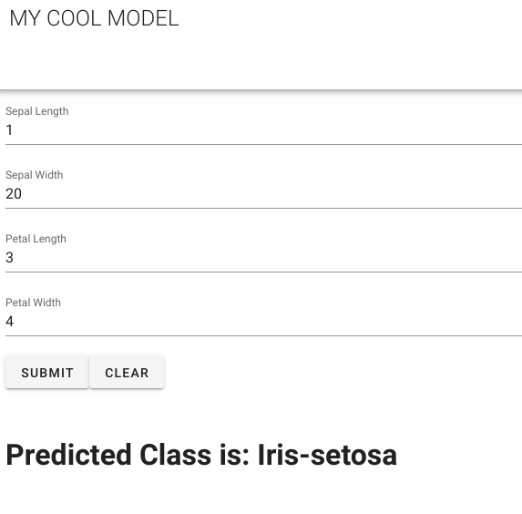

# 010_vue_flask_sklearn
ref: https://medium.com/uptake-tech/how-to-create-a-simple-frontend-api-and-model-with-python-vue-js-a51841c66f8a


- run
	1. python3 bkend/api.py
	2. npm run serve

## Project setup
```
npm install
```

### Compiles and hot-reloads for development
```
npm run serve
```

### Compiles and minifies for production
```
npm run build
```

### Lints and fixes files
```
npm run lint
```

### Customize configuration
See [Configuration Reference](https://cli.vuejs.org/config/).
